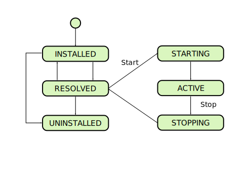

## OSGI

### Big Picture

* OSGi (Open Service Gateway initiative) specification 
	* describes 
		* a modular system 
		* a service platform 
	* for 
		* the Java programming language 
	* that implements
		* complete and dynamic component model

* Applications or components, 
	* coming in the form of bundles for deployment, 
	* can be remotely 
		* installed, 
		* started, 
		* stopped, 
		* updated, 
		* and uninstalled without requiring a reboot;

* Bundle
	* OSGi term for a component for the OSGi framework. 
	* JAR file containing 
		* a manifest
		* some combination of Java classes
		* embedded JAR files
		* native code
		* resources
	* May provide 
		* specific functionality for the user 	
		* may implement a service that other bundles can use 

* bundles 
	* can only use functionality from other bundles through shared services and packages

* OSGI approaches
	* **Service model vs. extender model**
		* They can be used independently or together
		* The **service model** approach uses
			* OSGi service concept
			* service registry as the extensibility mechanism. 
		* The **extender model**
			* uses the OSGi installed bundle set as the extensibility mechanism. 
	* **Bundled application** vs. **hosted framework**
		* **Bundled application**: your application is run completely on top of the OSGi framework as a set of bundles 
			* Creating applications completely as a set of bundles is the preferred approach since it allows the application to run on any OSGi framework, but this it not always possible.
		* **hosted framework**: your application hosts an embedded OSGi framework instance. 
			*  In such cases where it is not possible or desired, then you may host a framework instance inside your application, which will likely tie your application to that framework implementation
(although less so with the framework launching API introduced in the OSGi R4.2 specification).

### Lifecycle

Bundle Lifecycle
1. install
2. start
3. stop
4. uninstall

### Apache Felix

#### Big Picture

 * The Felix framework distribution comes with three bundles
	* located in the bundle/ directory of the framework distribution installation directory.
		* Gogo Runtime (core command processing functionality), 
		* Gogo Shell (text-based shell user interface), 
		* Gogo Command (basic set of commands), 
		* Bundle Repository (a bundle repository service). 
			* provides access to other bundles for easy installation. 
			* "obr:* scope"

#### Installation

	mkdir felix
	cd felix
	wget http://download.nextag.com/apache//felix/org.apache.felix.main.distribution-4.6.0.tar.gz
	tar xvf org.apache.felix.main.distribution-4.6.0.tar.gz
	cd felix-framework-4.6.0/
	java -jar bin/felix.jar

#### Apache Felix Gogo shell

#### References

<http://felix.apache.org/documentation/subprojects/apache-felix-framework/apache-felix-framework-usage-documentation.html>

