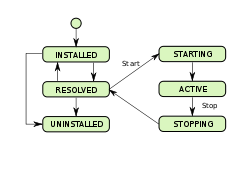

## OSGI

### Big Picture

* OSGi (Open Service Gateway initiative) specification 
	* describes 
		* a modular system 
		* a service platform 
	* for 
		* the Java programming language 
	* that implements
		* complete and dynamic component model
		
* OSGi Framework
	* An implementation of OSGi spec
		* Equinox
		* Felix
		* ...

* Applications or components, 
	* coming in the form of bundles for deployment, 
	* can be remotely 
		* installed, 
		* started, 
		* stopped, 
		* updated, 
		* and uninstalled without requiring a reboot;

* Bundle
	* OSGi term for a component for the OSGi framework. 
	* Actually, just a `.jar` file.
	* JAR file containing 
		* a manifest
		* some combination of Java classes
		* embedded JAR files
		* native code
		* resources
	* May provide 
		* specific functionality for the user 	
		* may implement a service that other bundles can use 

* bundles 
	* can only use functionality from other bundles through shared services and packages

* OSGI approaches
	* **Service model vs. extender model**
		* They can be used independently or together
		* The **service model** approach uses
			* OSGi service concept
			* service registry as the extensibility mechanism. 
		* The **extender model**
			* uses the OSGi installed bundle set as the extensibility mechanism. 
	* **Bundled application** vs. **hosted framework**
		* **Bundled application**: your application is run completely on top of the OSGi framework as a set of bundles 
			* Creating applications completely as a set of bundles is the preferred approach since it allows the application to run on any OSGi framework, but this it not always possible.
		* **hosted framework**: your application hosts an embedded OSGi framework instance. 
			*  In such cases where it is not possible or desired, then you may host a framework instance inside your application, which will likely tie your application to that framework implementation
(although less so with the framework launching API introduced in the OSGi R4.2 specification).

#### Lifecycle

Bundle Lifecycle
1. install
2. start
3. stop
4. uninstall

### Main Abstractions

* OSGi Framework
	* OSGi frameworks remember the installed and started bundles from run to run.

* Bundle (a `.jar` file)
	* With specific metadata in `META-INF/MANIFEST.MF`
		* Mandatory
			* `Manifest-Version`
				* i.e. `Manifest-Version: 1.0`
			* `Bundle-SymbolicName`
				* i.e. `Bundle−SymbolicName: org.osgi.example1`
		* Should be included
			* `Bundle-Name: {name of bundle}`
				* Useful because some OSGi implementations use that to print the name of the bundle
				* i.e. `Bundle-Name: Apache Felix Log Service`
			* `Bundle-Version: {version of bundle}`
				* Useful because some OSGi implementations use that to print the version of the bundle
				* i.e. `Bundle-Version: 1.0.1`
			* `Import-Package: {package};version="{version selection}"`
				* To declare the packages to import
				* i.e. `Import-Package: org.osgi.framework;version="[1.4,2)",org.osgi.service.log;version="[1.3,2)"`

* interface BundleActivator
	* responsibilities
		* Customizes the starting and stopping of a bundle.
	* constraints
		* if start() is invoked, for sure stop() will be too.
		* can be not thread safe because the framework must not concurrently call a BundleActivator object.
		* must have a public constructor that takes no parameters to be created by Class.newInstance().
	* main methods
		* public void start(BundleContext context) throws Exception;
		* public void stop(BundleContext context) throws Exception;
	* Manifest header
		* `BundleActivator: fully-qualified-class-name`
		
### System Services

The OSGi Alliance has specified many 'System' services. 
* Logging 	
	* The logging of information, warnings, debug information or errors is handled through the Log Service. It receives log entries and then dispatches these entries to other bundles that subscribed to this information.
* Configuration Admin
	* This service allows an operator to set and get the configuration information of deployed bundles
* Device Access 	
	* Facilitates the coordination of automatic detection and attachment of existing devices. This is used for Plug and Play scenarios.
* User Admin
	* This service uses a database with user information (private and public) for authentication and authorization purposes.
* IO Connector
	* The IO Connector Service implements the CDC/CLDC javax.microedition.io package as a service. This service allows bundles to provide new and alternative protocol schemes.
* Preferences
	* Offers an alternative, more OSGi-friendly mechanism to using Java’s default Properties for storing preferences.
* Component Runtime
	* The dynamic nature of services—they can come and go at any time—makes writing software harder. The Component Runtime specification can simplify handling these dynamic aspects by providing an XML based declaration of the dependencies.
* Deployment Admin
	* Standardizes access to some of the responsibilities of the management agent.
* Event Admin
	* Provides an inter-bundle communication mechanism based on a publish-and-subscribe model.
* Application Admin
	* Simplifies the management of an environment with many different types of applications that are simultaneously available. 
	
Lot of services can be found in the OSGi javadoc <http://www.osgi.org/javadoc/r4v42/index.html>
		
		
		
## References

<http://felix.apache.org/documentation/subprojects/apache-felix-framework/apache-felix-framework-usage-documentation.html>

