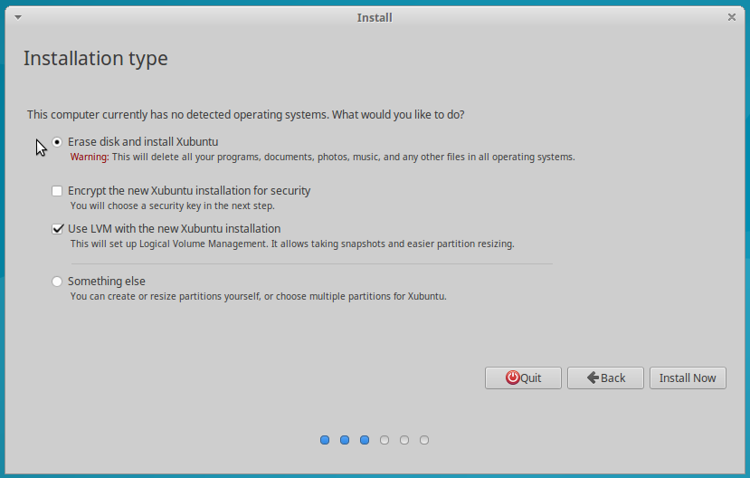

Setting UP Linux (Xubuntu) with GPT with LVM
==================================

Xubutu Default
--------------

Let's install Xubuntu using the default LVM setup.

Let's install gparted to inspect the partitioning

    sudo apt install gparted

You can continue by yourself, it is quite easy.

Otherwise, let's list the devices:

    cat /proc/partitions

So we have a disk called sda.

    sudo gdisk /dev/sda

Is there a graphic LVM ?

    system-config-lvm

<http://www.linux-mag.com/id/7796/>
